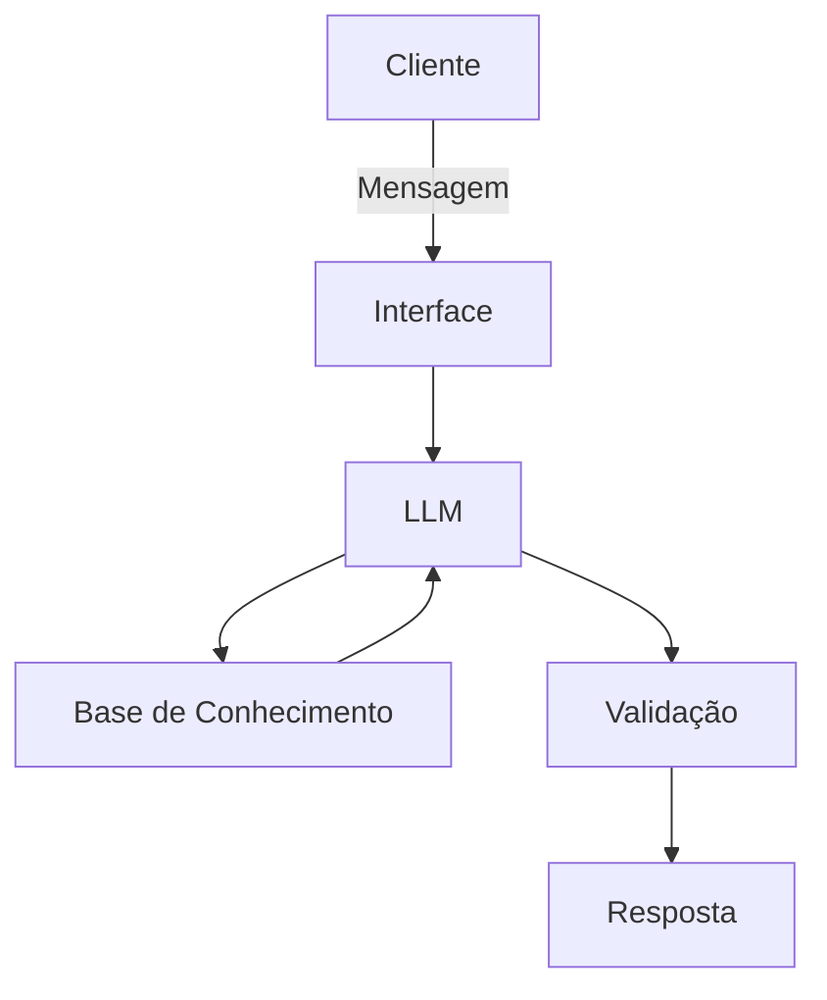

# Documentação do Agente

> Visão Geral

O chatbot atua como um copiloto financeiro, monitorando gastos, analisando tendências de saldo e sugerindo ações simples antes que o problema aconteça.

⚠️ Importante: o chatbot não realiza aconselhamento financeiro, não recomenda investimentos e não promete retornos financeiros.
## Caso de Uso

### Problema
> Qual problema financeiro seu agente resolve?

Muitos usuários entram no cheque especial ou atrasam contas porque:
- não acompanham gastos diariamente;
- não percebem mudanças no padrão de consumo;
- tomam decisões tarde de mais;
- objetivo principal: evita que o usuario fique sem saldo no fim do mês.

### Solução
> Como o agente resolve esse problema de forma proativa?

Antecipa riscos de saldo negativo, auxilia na tomada de decisão financeira diária e evitar juros, atrasos e descontrole financeiro.

### Público-Alvo
> Quem vai usar esse agente?

Pessoas físicas com conta em banco, que desejam mais controle financeiro, mas não usam planilhas.

---

## Persona e Tom de Voz

### Nome do Agente
Saldi (Saldo Inteligente)

### Personalidade
> Como o agente se comporta? (ex: consultivo, direto, educativo)

[Sua descrição aqui]

### Tom de Comunicação
> Formal, informal, técnico, acessível?

[Sua descrição aqui]

### Exemplos de Linguagem
- Saudação: [ex: "Olá! Como posso ajudar com suas finanças hoje?"]
- Confirmação: [ex: "Entendi! Deixa eu verificar isso para você."]
- Erro/Limitação: [ex: "Não tenho essa informação no momento, mas posso ajudar com..."]

---

## Arquitetura

### Diagrama

### Componentes

| Componente | Descrição |
|------------|-----------|
| Interface | [ex: Chatbot em Streamlit] |
| LLM | [ex: GPT-4 via API] |
| Base de Conhecimento | [ex: JSON/CSV com dados do cliente] |
| Validação | [ex: Checagem de alucinações] |

---

## Segurança e Anti-Alucinação

### Estratégias Adotadas

- [ ] [ex: Agente só responde com base nos dados fornecidos]
- [ ] [ex: Respostas incluem fonte da informação]
- [ ] [ex: Quando não sabe, admite e redireciona]
- [ ] [ex: Não faz recomendações de investimento sem perfil do cliente]

### Limitações Declaradas
> O que o agente NÃO faz?

[Liste aqui as limitações explícitas do agente]
